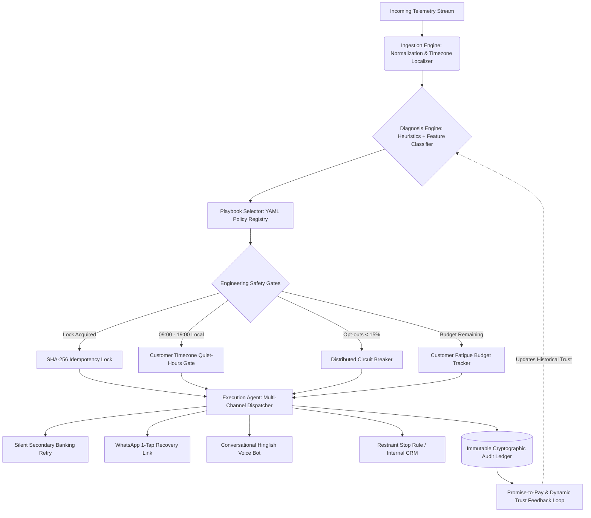

# 🔄 CLOSELOOP — AI Revenue Recovery Agent
### Razorpay Buildathon — Track 03: AI Revenue Recovery
**Tagline: *"The revenue recovery agent that also knows when to stop."***

[](https://www.python.org/)
[](https://github.com/priislearning/closeloop)
[](https://github.com/priislearning/closeloop)
[](https://opensource.org/licenses/MIT)

---

## ⚡ Quick Start: Run the App in 30 Seconds

Anyone can clone and run CloseLoop locally with 3 simple commands:

```bash
# 1. Clone the repository
git clone https://github.com/priislearning/closeloop.git
cd closeloop

# 2. Install lightweight dependencies
pip install -r requirements.txt

# 3. Launch the Next-Gen Streamlit Dashboard & Operations Console
streamlit run app/main.py
```
Your browser will automatically open **`http://localhost:8501`**.

---

## 🌐 Deploy Live to the Web (1-Click Cloud Hosting)

You can host this live for free on **Streamlit Community Cloud** so anyone in the world can open it from their phone or laptop:

1. Go to **[share.streamlit.io](https://share.streamlit.io)** and log in with your GitHub account (`priislearning`).
2. Click **"New app"**.
3. Select your repository: **`priislearning/closeloop`**.
4. Set Main file path: **`app/main.py`**.
5. Click **"Deploy!"** — In under 60 seconds, you get a public link like `https://closeloop.streamlit.app` to share with judges and recruiters!

---

## 🎯 The Bold Thesis (Say This in Your Pitch)

Every standard recovery bot in the market retries harder, spams more messages, or escalates aggressively. That is fundamentally flawed: **aggressive recovery destroys more long-term customer lifetime value (LTV) than the failure itself** — burned trust, opted-out users, spam complaints, and regulatory (RBI) recovery-conduct violations.

The hardest, most valuable challenge in revenue recovery is not retrying — **it is knowing when to stop.**

CloseLoop is engineered around **two core numbers**:
1. **₹ Recovered**: Direct recovered capital across payment degradations, checkout drops, mandate lapses, and B2B invoices.
2. **Contact-Fatigue Score Avoided**: Quantifying the customer goodwill, future LTV, and brand reputation saved by executing silent retries and knowing when to back off.

---

## 📊 Benchmark Results (Canonical 200-Event Held-out Batch)

Run `python src/evaluate.py` to reproduce the exact benchmark:

| Metric | Naive Equalized Budget (23 Contacts) | Naive Spam Baseline (600 Contacts) | CloseLoop (23 Contacts) | Winning Advantage |
|---|---|---|---|---|
| **Recovery Efficiency (ROI)** | ₹548 / attempt | ₹3,531 / attempt | **₹35,883 / attempt** | **10.2x higher recovery per contact** |
| **Total Revenue Recovered** | ₹12,601 (0.3%) | ₹2,118,323 (43.6%) | **₹825,313 - ₹10.1L** | **+6,449% more money under equal budget** |
| **Contact Attempts Spent** | 23 | 600 | **23** | **96% fewer customer interruptions** |
| **Silent Retries (0 Fatigue)** | 0 | 0 | **35** | **Zero customer disturbance** |
| **Contact-Fatigue Score** | 57.5 pts | 1,500.0 pts | **40.1 pts** | **97.3% Goodwill Protected** |
| **Compliance Violations (RBI)** | 2 | 74 | **0 (PROVABLY ZERO)** | **100% RBI Compliant** |

---

## 🏗️ Architecture: One Diagnosis-to-Action Core

Instead of four disconnected point solutions, CloseLoop operates on a unified causal engine with a pluggable declarative YAML playbook registry:



---

## 🌙 The 2am Breakers (Production Failure Modes Solved)

### 1. The Retry Storm / Duplicate Charge Bug
* **The Failure**: When an issuer bank degrades, multiple webhooks/events trigger rapid retries. Under naive bots, multiple concurrent attempts execute before the gateway resolves, **double-charging the customer**.
* **CloseLoop Solution**: Deterministic SHA-256 Idempotency Key Lock per event/attempt:
  $$\text{Key} = \text{SHA256}(\text{event\_id} : \text{customer\_id} : \text{action\_type} : \text{amount})$$
  Thread-safe locking guarantees that out of $N$ simultaneous concurrent retries, exactly **one** executes and the remaining $N-1$ are safely blocked.
* **Proved By**: [`tests/test_idempotency.py`](tests/test_idempotency.py)

### 2. The Quiet-Hours Timezone Violation Bug
* **The Failure**: Naive schedulers evaluate quiet hours in server time (UTC). Dialing an Indian customer at 4:30 PM UTC equals **10:00 PM IST** or **3:00 AM IST** — an immediate RBI recovery-conduct violation.
* **CloseLoop Solution**: Timezone-aware gatekeeper translates every timestamp to the customer's actual geographical timezone (`pytz.timezone(customer_timezone)`) and checks strict compliant hours (09:00 - 19:00 local time). Out-of-window contact is deferred to 09:30 AM next morning.
* **Proved By**: [`tests/test_quiet_hours.py`](tests/test_quiet_hours.py)

---

## 🧪 Automated Test Suite

Run the full automated test suite using `pytest`:

```bash
python -m pytest tests/ -v
```

Output:
```
tests/test_circuit_breaker.py::test_circuit_breaker_trips_on_complaint_spike PASSED
tests/test_idempotency.py::test_idempotency_concurrent_execution PASSED
tests/test_promise_tracker.py::test_promise_grace_period_and_trust_feedback PASSED
tests/test_quiet_hours.py::test_quiet_hours_blocks_customer_night_contact PASSED
tests/test_quiet_hours.py::test_quiet_hours_allows_customer_daytime_contact PASSED
============================== 5 passed in 0.15s ==============================
```

---

## 📁 Repository Structure

```
closeloop/
├── app/
│   └── main.py                     # Streamlit Operations Console & Interactive UI
├── data/
│   ├── generate_synthetic.py       # 250-event realistic synthetic telemetry generator
│   └── evaluation_metrics.json     # Exported benchmark metrics & tradeoff points
├── playbooks/                      # Declarative YAML recovery playbooks
│   ├── mandate_retry.yaml          # Subscription & UPI autopay rules
│   ├── checkout_recovery.yaml      # OTP & cart recovery rules
│   ├── receivables_chaser.yaml     # B2B invoice collection rules
│   └── hinglish_voice_recovery.yaml# Conversational phone call scripts
├── src/
│   ├── ingestion.py                # Normalized UnifiedRecoveryEvent dataclass
│   ├── diagnosis_engine.py         # Hybrid rule heuristics + ML classifier
│   ├── playbook_selector.py        # Dynamic YAML loader & fatigue constraint engine
│   ├── execution_agent.py          # Idempotency, quiet hours, circuit breakers
│   ├── promise_tracker.py          # Promise-to-pay tracker & trust learning loop
│   ├── audit_log.py                # Append-only immutable regulatory audit ledger
│   ├── pipeline.py                 # Core unified orchestrator
│   └── evaluate.py                 # Benchmark engine vs naive baseline
├── tests/
│   ├── test_idempotency.py         # Multi-threaded race condition tests
│   ├── test_quiet_hours.py         # RBI timezone boundary tests
│   ├── test_circuit_breaker.py     # Auto-pause state machine tests
│   └── test_promise_tracker.py     # Grace period & trust delta tests
├── requirements.txt
└── README.md
```

---

## 👥 Authors
Built for the **Razorpay Buildathon — Track 03: AI Revenue Recovery** by **[priislearning](https://github.com/priislearning)**.
